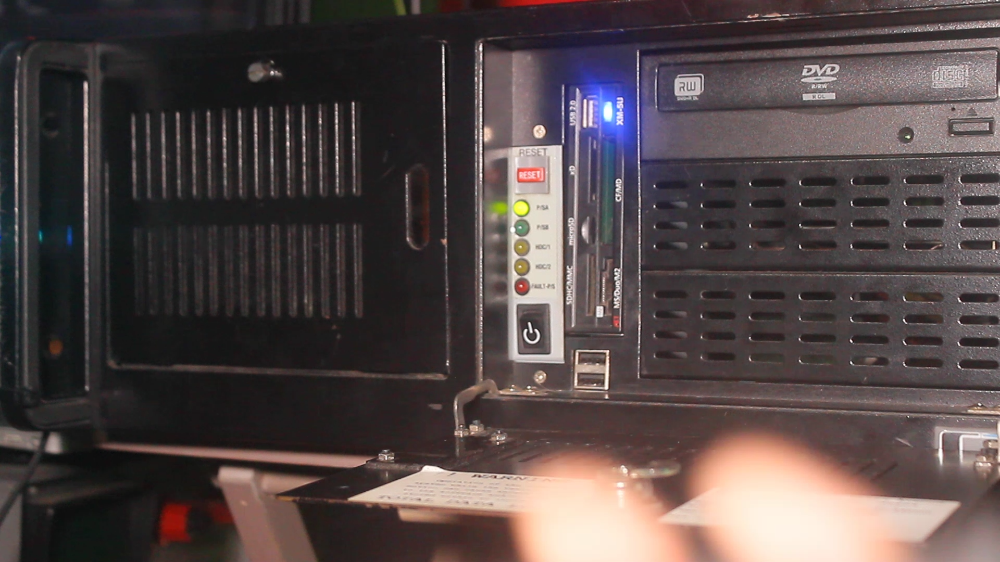

# serverlights
###WARNING: This is still mostly work in progress
## Background

This is my server. I recently recovered this from an office e-waste pile, and it has been serving me well as a Nextcloud server.
In its previous life, it servered as the PC on a camera truck, and uses a standard Asus P8Z77-V Deluxe motherboard. This means that the extra front panel lights on the case don't work because the motherboard doesn't have the headers and pins for it. (I did a series of videos where I went over the story of it more in depth)
To solve this, I developed a device with an Arduino to add the extra lights, and this repository features everything to get started with your own version.
## How this works
This works by having the Arduino connect to the server through serial, in which the server will send commands to the Arduino and it displays on the lights.
## Installation
Details are coming soon and will be on the wiki for this repo.
Note: The drivers are (at the moment) Linux exclusive, due to ease of developing tools